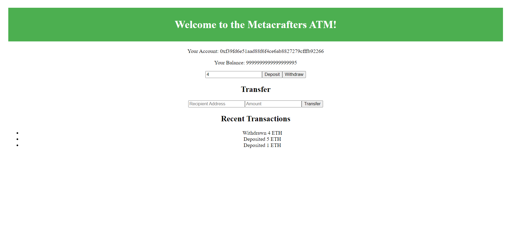
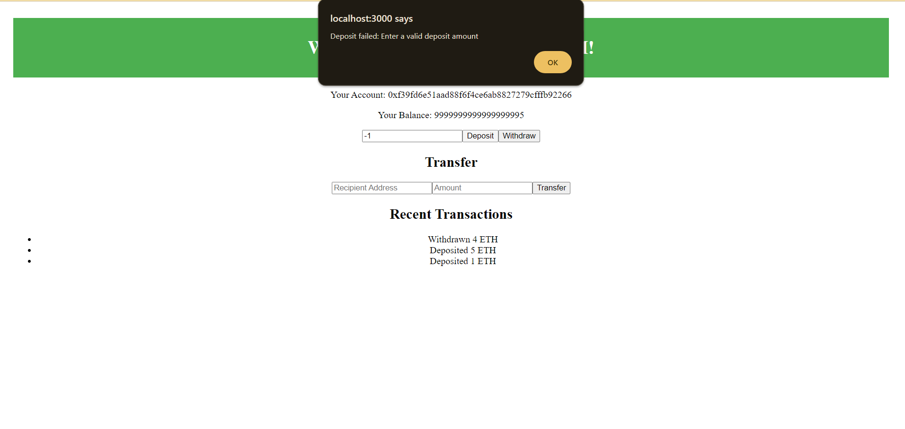

# Starter Next/Hardhat Project

After cloning the github, you will want to do the following to get the code running on your computer.

1. Inside the project directory, in the terminal type: npm i
2. Open two additional terminals in your VS code
3. In the second terminal type: npx hardhat node
4. In the third terminal, type: npx hardhat run --network localhost scripts/deploy.js
5. Back in the first terminal, type npm run dev to launch the front-end.

After this, the project will be running on your localhost. 
Typically at http://localhost:3000/

# Here is How Output will Show to You

 If you try to enter value Zero or less than zero then an error message will prompt
 

## Functionality:
# Deposit Function:
- The contract allows users to deposit funds securely. Upon a successful deposit, the balance is updated, and an event is emitted. The deposit function is designed to reject amounts less than or equal to zero, ensuring the security of the contract.

# Transfer Function:
- Users can transfer funds to another address through the transfer function. It checks for valid addresses, ensures the sender and recipient are different, and validates the availability of sufficient funds before - completing the transaction. Again, events are emitted to log the transaction.

# Frontend Integration:

- One of the key aspects is the visibility of these functionalities on the frontend. The smart contract's balance and transaction events are easily accessible through the frontend, providing a user-friendly experience.
